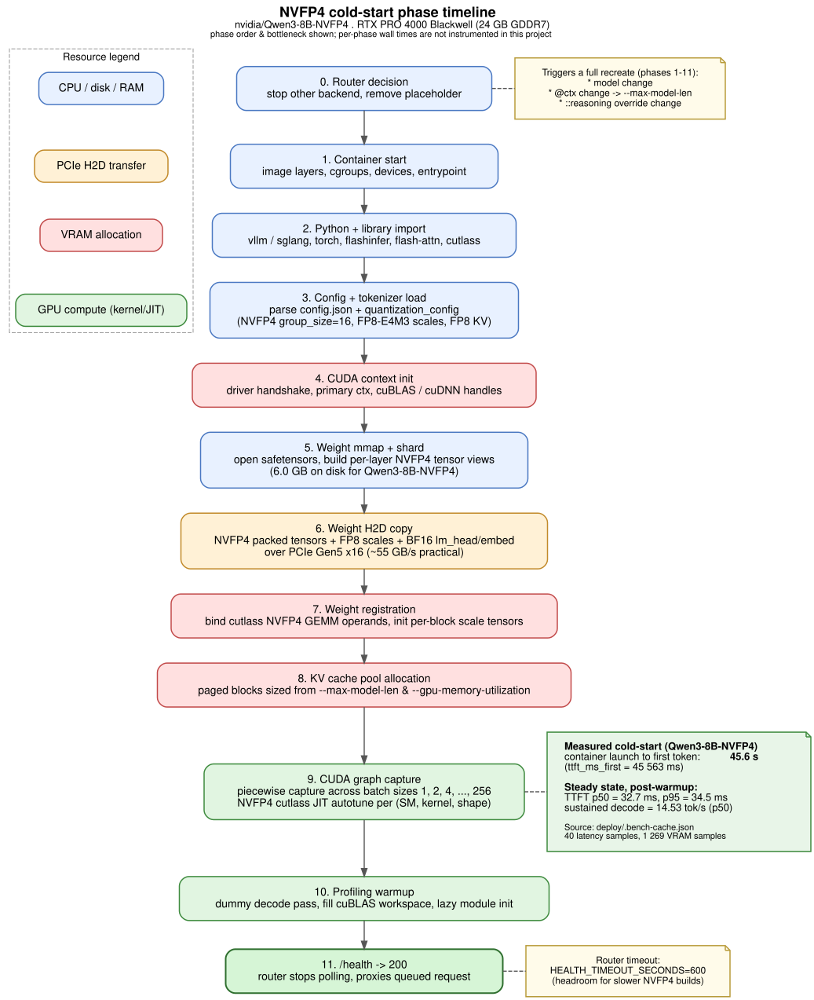
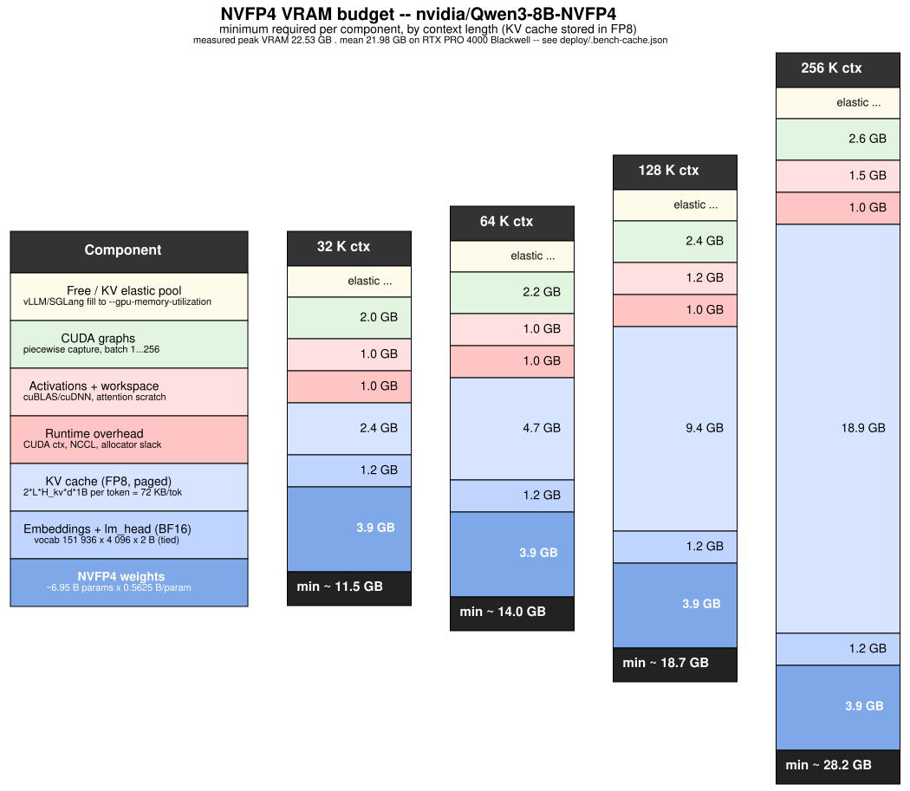

# NVFP4 cold start -- phases and VRAM budget

This page documents what happens between the moment a request first hits
port 11435 (vLLM) or 11436 (SGLang) for an NVFP4 model and the moment
the backend's `/health` returns `200`. It also breaks the steady-state
VRAM budget into the components that actually consume bytes -- model
weights, KV cache, CUDA graphs, runtime overhead -- at realistic
proportions for a Blackwell-class GPU.

The reference model is **`nvidia/Qwen3-8B-NVFP4`** (digest
`ccd10a893cbc`). It is the model the project has actual benchmark
results for in `deploy/.bench-cache.json` -- peak VRAM, mean VRAM, TTFT,
sustained throughput, and quality scores all measured end-to-end on the
hardware described below.

> **New to NVFP4, FP8, BF16 and friends?** Read
> [`nvfp4-number-formats.md`](nvfp4-number-formats.md) first -- it
> explains how a regular floating-point number gets stored in 4 / 8 /
> 16 bits, why model weights and the KV cache use *different* formats,
> and what `quant_algo: NVFP4` and `kv_cache_scheme: FP8` actually mean
> at the bit level. **New to LLM tokens and the prefill vs decode
> split?** [`llm-tokens-and-speed.md`](llm-tokens-and-speed.md) covers
> what an LLM token actually is, how BPE tokenisers work, and why
> decode is memory-bandwidth-bound (with worked examples on the same
> reference model used here).

> **Why a dedicated page.** "It uses 22 GB" is what `nvidia-smi` reports
> after vLLM has filled the elastic KV pool. That number does **not**
> tell you how much the model strictly needs, why a longer context can
> OOM at 24 GB while a shorter one fits, or how cold-start time relates
> to steady-state TTFT. The diagrams below answer all three.

---

## Hardware and data sources -- read this before quoting numbers

| Number type | Source | Hardware |
|---|---|---|
| Cold-start time, steady TTFT, sustained tok/s, mean/peak VRAM | `deploy/.bench-cache.json`, key `nvidia/Qwen3-8B-NVFP4@ccd10a893cbc` | **RTX PRO 4000 Blackwell, 24 GB GDDR7, PCIe Gen5 x16** (workstation card) |
| Quality scores (GSM8K, HumanEval, tools, leak) | same bench cache row + per-sample inspect logs at `/var/cache/devai/bench/inspect-logs/` | RTX PRO 4000 Blackwell |
| Per-component byte breakdown in Sec. 2 | NVFP4 spec + Qwen3-8B `config.json` | hardware-independent arithmetic |
| Per-phase wall times in Sec. 1 | **not instrumented in this project** -- the diagram shows phase order and bottleneck only, not duration | -- |
| Sec. 3 Blackwell GPU reference table | NVIDIA public datasheets -- **not measured here** | extrapolation |
| Sec. 4 32B / 70B scaling rows | analytical from public configs, **not run** | extrapolation; does not fit a single 24 GB card |

There is no enterprise B100/B200/GB200 anywhere in this project's data
path. Treat anything outside the 24 GB row as a paper extrapolation.

---

## 1. Phase timeline



Source: [`nvfp4-coldstart-phases.dot`](nvfp4-coldstart-phases.dot).
Re-render with:

```bash
dot -Tsvg docs/nvfp4-coldstart-phases.dot \
    -o docs/nvfp4-coldstart-phases.svg
```

### Measured cold-start aggregate

The bench harness measures the wall time from `vllm serve` launch to
the first emitted token (`ttft_ms_first`). For Qwen3-8B-NVFP4:

| Metric | Value | Where |
|---|---|---|
| Cold-start TTFT (container launch -> first token) | **45 563 ms ~ 45.6 s** | `metrics.ttft_ms_first` |
| Steady-state TTFT, p50 | **32.7 ms** | `metrics.ttft_ms_steady_p50` |
| Steady-state TTFT, p95 | **34.5 ms** | `metrics.ttft_ms_steady_p95` |
| Sustained decode throughput, p50 | **14.53 tok/s** | `metrics.tps_sustained_p50` |
| Latency samples used | 40 | `metrics.n_latency_samples` |

The cold-start figure rolls up phases 1-11 from the diagram. **There
is no per-phase instrumentation in this project**, so the diagram
shows ordering and which resource each phase touches but does not put
a number on individual phases. If you need per-phase data, instrument
`scripts/bench/bench_runner.py` or capture timestamps from inside the
vLLM container -- neither has been done here.

### What each phase is doing

| # | Phase | Bottleneck |
|---|---|---|
| 0 | Router decision -- stop other backend, remove the `sleep infinity` placeholder | libpod RPC |
| 1 | Container start -- image layer mount, cgroups, devices, entrypoint | container runtime |
| 2 | Python + library import -- `vllm` / `sglang`, `torch`, `flashinfer`, `flash-attn`, cutlass NVFP4 kernels | disk + Python startup |
| 3 | Config + tokenizer load -- parse `config.json`, `quantization_config` (NVFP4 group_size=16, FP8-E4M3 scales, FP8 KV cache), tokenizer | RAM, single-threaded |
| 4 | CUDA context init -- driver handshake, primary context, cuBLAS/cuDNN handles | GPU driver |
| 5 | Weight `mmap` + shard view construction (6.0 GB on disk for Qwen3-8B-NVFP4) | page cache |
| 6 | Weight H2D copy -- packed NVFP4 tensors + FP8 scales + BF16 lm_head/embed | PCIe Gen5 x16 (~55 GB/s practical) |
| 7 | Weight registration -- bind cutlass NVFP4 GEMM operands, materialize per-block scale tensors | GPU memory ops |
| 8 | KV cache pool allocation -- paged blocks sized from `--max-model-len` and `--gpu-memory-utilization` | GPU malloc |
| 9 | **CUDA graph capture** -- piecewise capture across batch sizes 1, 2, 4, ..., 256; cutlass NVFP4 JIT autotune | GPU compile |
| 10 | Profiling warmup -- dummy decode pass, fill cuBLAS workspace, trigger lazy module init | GPU compute |
| 11 | `/health` -> 200 -- router stops polling and proxies the queued request | -- |

**Why phase 9 is the longest pole.** NVFP4 GEMMs run via specialized
cutlass kernels that are JIT-compiled and autotuned the first time the
runtime encounters a given `(GPU SM, kernel, shape)` triple. vLLM and
SGLang both cache the resulting binaries in
`~/.cache/{vllm,sglang}/torch_compile/` (mounted into the container via
the `cache_root` volume). The first cold start on a freshly built image
pays the full JIT cost; subsequent starts of the same model+context
+batch envelope reuse the cache and complete faster (the 45.6 s above
already benefits from a warm torch_compile cache for this model). The
cache is keyed on SM version, so moving the same image to a different
Blackwell card invalidates it.

**This is why `HEALTH_TIMEOUT_SECONDS` defaults to 600 s.** The
measured 45.6 s for an 8B-class NVFP4 with a warm compile cache is
well under that ceiling, but a fresh image, a slower model
(`ykarout/Qwen3.5-9B-NVFP4` showed `startup_seconds=147` on the same
card during probing), or a different Blackwell SM target would push
this much higher. Do not lower the ceiling without measuring against
the model mix you actually serve. See `gpu-arbiter/main.go` for the
exact polling loop.

### What triggers a full cold start

The router tracks `currentModel`, `currentContext`, and
`currentReasoningOverride` per backend. **Any** of these changing
recreates the container and walks phases 1-11 again:

- Switching model (e.g. `Qwen3-8B-NVFP4` -> `Qwen3-14B-NVFP4`).
- Changing context cap via the `@<ctx>` suffix
  (e.g. `...-NVFP4@32768` -> `...-NVFP4@131072`) -- this re-runs container
  creation with a different `--max-model-len` / `--context-length`.
- Changing reasoning override (`::nothink`, `::high`, etc.) -- this
  changes the entrypoint flags (`--reasoning-parser ...` injection).

A request that matches the currently loaded model on all three axes
skips phases 1-10 entirely and goes straight to inference.

---

## 2. VRAM budget at realistic proportions



Source: [`nvfp4-vram-budget.dot`](nvfp4-vram-budget.dot).
Re-render with:

```bash
dot -Tsvg docs/nvfp4-vram-budget.dot \
    -o docs/nvfp4-vram-budget.svg
```

The reference model is `nvidia/Qwen3-8B-NVFP4`. The component sizes
scale predictably to other model classes (see Sec. 4).

### How each component is sized

#### NVFP4 weights -- ~3.9 GB

NVFP4 stores each weight as:

- **4-bit value** in E2M1 layout (1 sign, 2 exponent, 1 mantissa).
- **8-bit FP8 (E4M3) scale** shared across each contiguous block of
  16 weights (so 0.5 effective bits per value for the per-block scale).
- **32-bit FP32 per-tensor scale** -- negligible (one number per tensor).

Effective storage: **4.5 bits per parameter ~ 0.5625 bytes/param**.

Qwen3-8B has ~8.2 B total parameters; with `lm_head` excluded from
quantization (`quantization_config.ignore: [lm_head]`) and tied
embeddings, ~6.95 B transformer parameters get NVFP4 -> **~3.9 GB**
of NVFP4 tensors on device.

The on-disk safetensors total is **6.0 GB** -- the difference vs the
~3.9 GB live tensor figure above is BF16 embeddings + per-block FP8
scales + safetensors metadata.

#### Embeddings + lm_head (BF16) -- ~1.2 GB

Quantizing the embedding table and output projection to NVFP4 hurts
output quality enough that the `nvidia/*-NVFP4` checkpoints leave them
in BF16. Qwen3-8B uses tied embeddings, so:

- Embedding table: 151 936 x 4 096 x 2 B = **1.24 GB**
- `lm_head`: tied with embeddings -> no extra cost.

#### KV cache (FP8, paged) -- **scales linearly with context**

Per token, the KV cache holds K and V activations for every layer:

```
bytes_per_token = 2 (K + V) x num_layers x num_kv_heads x head_dim x dtype_bytes
```

Qwen3-8B-NVFP4 declares
`quantization_config.kv_cache_scheme = {num_bits: 8, type: float}` -- 
KV is stored as **FP8 (1 byte per element)**, halving the per-token
cost vs the FP16 KV that older NVFP4 checkpoints used.

For Qwen3-8B (36 layers, 8 KV heads via GQA, head_dim 128, FP8):

```
bytes_per_token = 2 x 36 x 8 x 128 x 1 = 73 728 B = 72 KB / token
```

Multiplied by context length:

| Context | KV bytes |
|---|---|
| 32 K  | 2.36 GB  |
| 64 K  | 4.72 GB  |
| 128 K | 9.44 GB  |
| 256 K | 18.87 GB |

This is the dominant scaling cost. Doubling the context doubles the
KV cache; **everything else in the budget is roughly constant**.

> **Sanity check on FP8 KV.** This means an NVFP4 checkpoint with FP8
> KV roughly doubles the maximum context that fits in a given VRAM
> budget compared to an otherwise identical model with FP16 KV. The
> long-context fits in Sec. 3 below assume FP8 KV, matching the reference
> model.

#### CUDA graphs -- ~2.0-2.6 GB

vLLM piecewise-captures graphs for each decode batch size in
`{1, 2, 4, 8, 16, 32, 64, 128, 256}` by default. Each graph holds the
fused kernels, input/output handles, and intermediate tensors for that
shape. NVFP4 GEMMs add their cutlass workspace tensors. Cost grows
slightly with model size (more layers = more captured ops) and with
context (larger attention scratch sliced into the graph).

Disable with `--enforce-eager` to reclaim ~2 GB at the cost of
~10-25 % decode throughput.

#### Activations + workspace -- ~1.0-1.5 GB

cuBLAS/cuDNN scratch space, attention output buffers, paged-attention
metadata tables, prefix-cache index tables. Grows mildly with batch
size and context.

#### Runtime overhead -- ~1.0 GB

CUDA primary context (300-600 MB), NCCL communicator (small on a single
GPU), PyTorch caching allocator slack, miscellaneous small allocations
from the runtime.

#### Free / KV elastic pool -- fills the rest

This is the one cell that is **not** a fixed footprint. vLLM and SGLang
both grow the paged-KV pool until total VRAM hits
`--gpu-memory-utilization` (router default ~ 0.94). On the reference
24 GB card with strict-minimum ~11.5 GB at 32 K context, the runtime
adds ~10.5 GB of extra paged blocks for batched concurrent decode ->
the bench harness recorded `peak_vram_gb=22.53` and `mean_vram_gb=21.98`
across 1 269 VRAM samples.

### Measured bench results -- Qwen3-8B-NVFP4

The diagram above shows the **strict minimum** per component. The
numbers the bench harness actually wrote to `deploy/.bench-cache.json`
for `nvidia/Qwen3-8B-NVFP4@ccd10a893cbc` are reproduced below. All
measurements come from a single RTX PRO 4000 Blackwell card.

#### Resource & latency

| Metric | Value | Field |
|---|---|---|
| Peak VRAM observed | **22.53 GB** | `metrics.peak_vram_gb` |
| Mean VRAM (1 269 samples) | **21.98 GB** | `metrics.mean_vram_gb` |
| Cold-start TTFT | **45 563 ms** | `metrics.ttft_ms_first` |
| Steady TTFT, p50 | **32.7 ms** | `metrics.ttft_ms_steady_p50` |
| Steady TTFT, p95 | **34.5 ms** | `metrics.ttft_ms_steady_p95` |
| Sustained decode, p50 | **14.53 tok/s** | `metrics.tps_sustained_p50` |

**Reading the VRAM numbers.** Peak (22.53 GB) and mean (21.98 GB) are
within ~0.5 GB of each other -- the elastic KV pool fills early and
stays full. The strict minimum from the diagram (~11.5 GB at the
context the bench used) is roughly half of that; the difference is
the elastic pool of paged-attention blocks vLLM grew up to its
`--gpu-memory-utilization` cap (~0.94 of physical VRAM ~ 22.6 GB).
Do **not** read the 22.53 GB peak as a footprint floor -- it is the
budget the elastic pool filled to, and a different
`--gpu-memory-utilization` would shift it directly.

#### Quality scores

| Task | Result | n | Field |
|---|---|---|---|
| GSM8K subset | **score 0.98** | 100 | `tasks.gsm8k_subset_100.score` |
| HumanEval subset | **pass@1 0.94** | 50 | `tasks.humaneval_subset_50."pass@1"` |
| Tools-use suite | **score 1.0** (single_arg, multi_tool_pick, empty_schema, result_followup all 1.0) | 20 | `tasks.tools_use_20` |
| Leak probe (special-token leakage) | **0/40 prompts leaked any of 20 tracked markers**, 0 errors | 40 | `tasks.leak_probe` |

Per-sample logs (`inspect_ai` `.eval` zip-of-JSON files) are at
`/var/cache/devai/bench/inspect-logs/` if you need prompt-level detail
beyond the rolled-up cache row. Read with:

```python
from inspect_ai.log import read_eval_log
log = read_eval_log("/var/cache/devai/bench/inspect-logs/<task>.eval")
for s in log.samples:
    print(s.id, s.input[:60], "->", s.output.completion[:80],
          "score:", list(s.scores.values())[0].value)
```

...or `inspect view start --log-dir /var/cache/devai/bench/inspect-logs`
for the bundled viewer.

---

## 3. Blackwell GPU reference (paper extrapolation)

> **Not measured here.** Only the **RTX PRO 4000 Blackwell** row
> reflects bench data from this project. Other rows are taken from
> NVIDIA public datasheets and used purely to project how the
> Qwen3-8B-NVFP4 budget would map to other Blackwell parts. NVFP4 is
> a first-class native format on all of them (5th-generation Tensor
> Cores).

| Part | VRAM | Memory | Class | Used in this project? |
|---|---|---|---|---|
| **RTX PRO 4000 Blackwell** | **24 GB** | **GDDR7** | Workstation | **yes -- all bench rows** |
| RTX 5090 (GB202) | 32 GB | GDDR7 | Consumer | no |
| RTX PRO 6000 Blackwell | 96 GB | GDDR7 | Workstation | no |
| B100 (PCIe / SXM) | 192 GB | HBM3e | Datacenter | no |
| B200 (SXM) | 192 GB | HBM3e | Datacenter | no |
| GB200 (superchip, 2x B200) | 384 GB | HBM3e | Datacenter | no |

Projecting the Qwen3-8B-NVFP4 strict-minimum budget from Sec. 2 onto each
part (NVFP4 weights + BF16 embed + FP8 KV @ ctx + ~4 GB fixed
overhead -- analytical, not benchmarked):

| GPU VRAM | Max context that fits Qwen3-8B-NVFP4 (strict min) | Headroom above strict min |
|---|---|---|
| 24 GB  | 128 K (~18.7 GB strict; 256 K crosses 24 GB and probe-OOMed) | ~5 GB at 128 K -> modest elastic pool |
| 32 GB  | 256 K (~28 GB strict) just fits, marginal headroom | ~4 GB at 256 K |
| 96 GB  | any context the model supports + comfortable headroom | enough for high batched throughput |
| 192 GB | trivially fits any context the model supports | enough to co-host a 70B-class NVFP4 |

The router emits `--gpu-memory-utilization` (vLLM) and
`--mem-fraction-static` (SGLang) derived from `GPU_MEMORY_GB` in `.env`
multiplied by the per-band fraction in the matrix probe. Set
`GPU_MEMORY_GB` to the **physical** VRAM of your card; the router
handles the rest.

---

## 4. Scaling to other model sizes (paper extrapolation)

> **Not run.** These rows are arithmetic from public `config.json` data
> and the NVFP4 byte-per-param figure. None of the 32B/70B totals were
> verified on hardware -- the 24 GB workstation card this project uses
> cannot fit either. They are included to make the scaling rule
> obvious, not as a benchmark. KV columns assume FP8 KV like the
> reference model; an FP16-KV checkpoint doubles those bytes.

Only the weights and KV cache change with model size; CUDA graphs and
runtime overhead stay roughly flat (within +/-50 %).

| Class | NVFP4 weights | BF16 embed | KV / token (FP8) | KV @ 32 K | KV @ 128 K |
|---|---|---|---|---|---|
| 8B (Qwen3-8B, reference)  | ~3.9 GB  | ~1.2 GB | 72 KB  | 2.4 GB  | 9.4 GB  |
| 32B (Qwen3-32B class)     | ~18.0 GB | ~1.5 GB | 128 KB | 4.0 GB  | 16.0 GB |
| 70B (Llama-3.1 class)     | ~39.4 GB | ~2.1 GB | 160 KB | 5.0 GB  | 20.0 GB |

Strict minimums (weights + embed + KV + ~4 GB fixed overhead):

| Class | 32 K min | 128 K min |
|---|---|---|
| 8B  | ~11.5 GB | ~18.7 GB |
| 32B | ~27.5 GB | ~39.5 GB |
| 70B | ~50.5 GB | ~65.5 GB |

By the same arithmetic, a 192 GB B200 would host a 70B NVFP4 with
FP8 KV at 128 K with roughly ~125 GB of elastic-KV headroom, and a
96 GB RTX PRO 6000 would host the same model at ~96 K context once
graphs + workspace + a non-zero elastic pool are accounted for.
Neither figure was measured.

---

## 5. Operational implications

- **`HEALTH_TIMEOUT_SECONDS=600`** sits well above the measured
  cold-start for the reference model (45.6 s) but leaves headroom for
  fresh-image cold JIT, larger NVFP4 builds, and SM-cache invalidation
  on a different Blackwell GPU. Do not lower it without re-measuring
  against your actual model mix.
- **Context-cap changes are not free.** Each `@<ctx>` change re-walks
  phases 1-11. The router intentionally exposes the suffix at picker
  time so the user makes a deliberate choice and avoids accidental
  thrash from arbitrary client requests.
- **The bench cache is the truth source for VRAM and TTFT.** `peak_vram_gb`
  is what the runtime allocated under the elastic policy, not the
  strict minimum. Use the per-component breakdown in Sec. 2 to predict how
  a model will behave at a context the bench has not yet covered.
- **`--enforce-eager` reclaims ~2 GB.** Useful as a stop-gap when a
  model fits its strict minimum but loses to graphs+KV by a small
  margin. Pay for it in throughput (~10-25 % slower decode).
- **Quality scores are bench-cache rollups.** The 0.98 GSM8K / 0.94
  HumanEval pass@1 / 1.0 tools / 0% leakage figures for this model
  came from `scripts/bench/`; per-prompt judgments live in the
  `inspect-logs/*.eval` files. If a number looks too good or too bad,
  open the per-sample log before attributing it to the model.

---

## References

- NVIDIA NVFP4 format reference -- block-scaled FP4 (E2M1) with FP8-E4M3
  per-block scales, group_size 16; supported natively on Blackwell
  Tensor Cores. See the
  [Transformer Engine NVFP4 docs](https://docs.nvidia.com/deeplearning/transformer-engine/user-guide/api/common.html)
  and the
  [NVIDIA Qwen3-8B-NVFP4 model card](https://huggingface.co/nvidia/Qwen3-8B-NVFP4)
  for `quantization_config` layout, including the FP8 `kv_cache_scheme`.
- vLLM CUDA graph capture: `vllm.config.CompilationConfig`,
  `--enforce-eager`, `--cuda-graph-sizes`.
- SGLang RadixAttention + cuda graph capture: SGLang server args
  `--disable-cuda-graph`, `--cuda-graph-bs`.
- Project-internal: [`docs/router.md`](router.md) for the request
  rewrite chain, [`docs/backends.md`](backends.md) for the lifecycle
  state machine and probing procedure. Bench tooling lives at
  `scripts/bench/` with cache at `deploy/.bench-cache.json` and
  per-sample logs at `/var/cache/devai/bench/inspect-logs/`.
