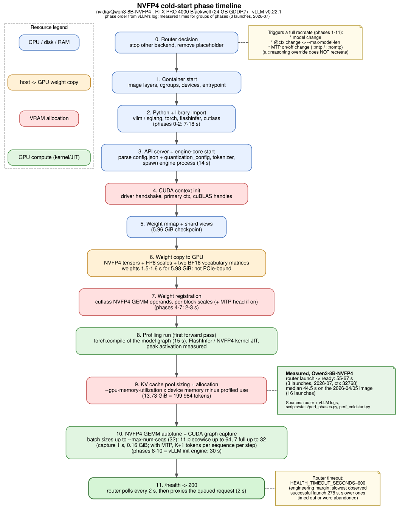
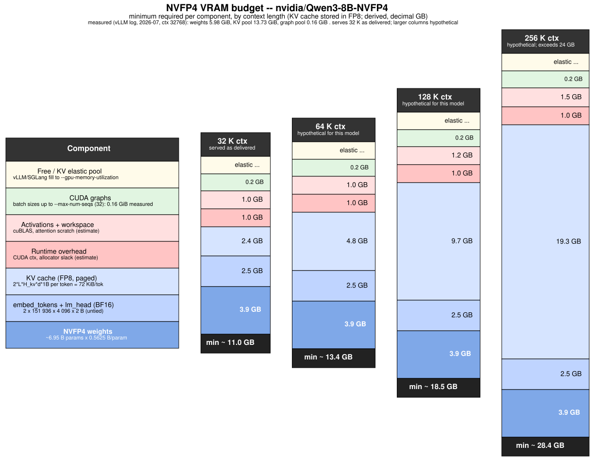

# NVFP4 cold start -- phases and VRAM budget

This page documents what happens between the moment a request first hits
port 11435 (vLLM) or 11436 (SGLang) for an NVFP4 model and the moment
the backend's `/health` returns `200`. It also breaks the steady-state
VRAM budget into the components that actually consume bytes -- model
weights, KV cache, CUDA graphs, runtime overhead -- at realistic
proportions for a Blackwell-class GPU.

The reference model is **`nvidia/Qwen3-8B-NVFP4`** (digest
`ccd10a893cbc`), the model with the longest measurement record on the
hardware described below: bench runs on 2026-05-02, 2026-05-05 and
2026-07-17, and 16 router launches in 2026-04/05 plus 5 later. The
Qwen3.8-27B builds served on vllm-devai (2026-09) supply the 27B
start-up timings in Sec. 1. Every number below says whether it is
measured (with its n, number of runs and date), derived from arithmetic,
or taken from a datasheet. See [statistics-primer.md](statistics-primer.md)
Sec. 1, 9 and 14 for how to read them.

> **New to NVFP4, FP8, BF16 and friends?** Read
> [`nvfp4-number-formats.md`](nvfp4-number-formats.md) first -- it
> explains how a regular floating-point number gets stored in 4 / 8 /
> 16 bits, why model weights and the KV cache use *different* formats,
> and what `quant_algo: NVFP4` and `kv_cache_scheme: FP8` actually mean
> at the bit level. **New to LLM tokens and the prefill vs decode
> split?** [`llm-tokens-and-speed.md`](llm-tokens-and-speed.md) covers
> what an LLM token actually is, how BPE tokenisers work, and why
> decode is memory-bandwidth-bound (with worked examples on the same
> reference model used here).

> **Why a dedicated page.** "It uses 22 GB" is what `nvidia-smi` reports
> after vLLM has filled the elastic KV pool. That number does **not**
> tell you how much the model strictly needs, why a longer context can
> OOM at 24 GB while a shorter one fits, or how cold-start time relates
> to steady-state TTFT. The diagrams below answer all three.

---

## Hardware and data sources -- read this before quoting numbers

| Number type | Source | Kind |
|---|---|---|
| Cold-start TTFT, steady TTFT, decode rate, peak/mean VRAM of the reference model | bench runs (`deploy/.bench-cache.json` row `nvidia/Qwen3-8B-NVFP4@ccd10a893cbc`; the cache keeps only the latest run, older values are quoted with their date) | measured; one run per date |
| Launch-to-ready times | router log `/var/cache/devai/logs/devai-router.log` ("starting" -> "ready") | measured; many launches |
| Per-phase start-up times in Sec. 1 | vLLM's own log lines per launch (`/var/cache/devai/logs/devai-vllm*.log`) | measured; per launch |
| Per-component byte breakdown in Sec. 2 | NVFP4 spec + Qwen3-8B `config.json`, checked against vLLM's memory lines | derived (arithmetic) |
| Sec. 3 Blackwell GPU reference table | NVIDIA public datasheets | external; **not measured here** |
| Sec. 4 32B / 70B scaling rows | analytical from public configs | derived; **not run**, does not fit a 24 GB card |

All measurements come from one **RTX PRO 4000 Blackwell (24 GB GDDR7,
PCIe Gen5 x16)**; vLLM reports 23.43 GiB (25.2 GB) of device memory on
it. VRAM measured by `nvidia-smi` or vLLM is reported in **GiB** (the
bench divides MiB by 1024; its field names say "gb"). Byte counts derived
from parameter counts are decimal GB. Context sizes follow the usual
1 K = 1 024 tokens (32 K = 32 768). Quality scores for this model are not
repeated here; see [`bench-results.md`](bench-results.md) (2026-05-05
sweep) and the current cache row, each with its date.

**Log hygiene.** The persisted logs repeat whole blocks verbatim: the
logger sidecar replays a container's history when it restarts. The router
log has 75 975 lines of which 27 018 are distinct, and 3 245 `starting`
lines of which 742 are distinct. Every count below counts each line once,
timestamp included.

There is no enterprise B100/B200/GB200 anywhere in this project's data
path. Treat anything outside the 24 GB row as a paper extrapolation.

---

## 1. Phase timeline



Source: [`nvfp4-coldstart-phases.dot`](nvfp4-coldstart-phases.dot).
Re-render with:

```bash
dot -Tsvg docs/nvfp4-coldstart-phases.dot \
    -o docs/nvfp4-coldstart-phases.svg
```

### What each phase is doing

The order follows vLLM's own log lines. Where the log times a group of
phases, the measured range is given (Qwen3-8B-NVFP4 in 2026-07 /
Qwen3.8-27B-devai; details in the next table).

| # | Phase | What limits it |
|---|---|---|
| 0 | Router decision -- stop other backend, remove the `sleep infinity` placeholder | libpod RPC |
| 1 | Container start -- image layer mount, cgroups, devices, entrypoint | container runtime |
| 2 | Python + library import -- `vllm` / `sglang`, `torch`, `flashinfer`, cutlass NVFP4 kernels | disk + Python start-up; phases 0-2 together 7-18 s / 3-16 s |
| 3 | API server and engine-core start -- parse `config.json` and `quantization_config` (NVFP4 group_size 16, FP8-E4M3 scales, FP8 KV cache), load the tokenizer, spawn the engine process | measured 14 s / 11-16 s (args line -> engine-core line) |
| 4 | CUDA context init -- driver handshake, primary context, cuBLAS handles | GPU driver |
| 5 | Weight `mmap` + shard views (5.96 GiB on disk for Qwen3-8B-NVFP4) | page cache / disk |
| 6 | Weight copy to the GPU -- packed NVFP4 tensors, FP8 scales, BF16 vocabulary matrices | measured 1.5-1.6 s for 5.98 GiB / 1.5-4.9 s for 14.5-16 GiB: a few GB/s, far below PCIe Gen5, so not PCIe-bound (what binds it was not measured) |
| 7 | Weight registration -- bind cutlass NVFP4 GEMM operands, per-block scales; with MTP, the drafter head too | GPU memory ops; phases 4-7 together 2-3 s / 8-11 s |
| 8 | Profiling run -- first forward pass at the largest batch; torch.compile compiles the model graph and FlashInfer / NVFP4 kernels are JIT-built here; the peak activation is measured | GPU compile |
| 9 | KV-cache pool sizing and allocation -- `--gpu-memory-utilization` x device memory minus what the profiling run measured | GPU malloc |
| 10 | NVFP4 GEMM autotune and CUDA-graph capture -- batch sizes up to `--max-num-seqs` (with MTP, K+1 tokens per sequence per step) | GPU compute; phases 8-10 are vLLM's "init engine": 30 s / 96-236 s |
| 11 | `/health` -> 200 -- router stops polling (every 2 s) and proxies the queued request | 2 s / 1-7 s |

### Measured cold start -- the aggregate

Two measurements cover phases 0-11 as a whole. They are different
quantities:

- **Router launch-to-ready**: from the router's `starting` log line to its
  `ready` line. Timestamps have 1-s resolution and the router polls
  `/health` every 2 s, so values are quantised to about 2 s. This is how
  long a request waits before the backend can serve it.
- **Cold-start TTFT** (`ttft_ms_first` in the bench): client-side time to
  the first token of the first request of a bench run. It includes the
  launch plus that request, and it is a cold start only when that request
  triggered a launch (in 3 of 27 current cache rows it did not).

For Qwen3-8B-NVFP4 (reproduce with `scripts/stats/perf_coldstart.py`,
`perf_phases.py` and `perf_bench_cache.py`; the 2026-05-02 values survive
only as quoted in [`bench-results.md`](bench-results.md) and earlier
versions of this page, the 2026-05-05 values in that run's summary log
`/var/cache/devai/bench/bench-vllm-run-20260505T140328Z.log`):

| Quantity | Value | n, runs, date | Notes |
|---|---|---|---|
| Router launch-to-ready | median 44.5 s (95 % CI 43-52 s), range 42-54 s | 16 launches, 2026-04-29..05-05 | the vLLM image of that period; CI: order statistics, assuming exchangeable launches |
| same, 2026-07 | 55, 56, 67 s | 3 launches, 2026-07-16..19, ctx 32768, vLLM v0.22.1 | phases in the table below |
| Cold-start TTFT | 45.6 s | 1 request, one run, 2026-05-02 | quoted value; context not recorded; not retained |
| | 43.5 s; 56.0 s | 1 request each: 2026-05-05 (ctx 131072); 2026-07-17 (ctx 32768) | one run each |
| Steady-state TTFT p50 / p95 | 32.7 / 34.5 ms | 39 warm requests, one run, 2026-05-02 | quoted value, not retained; type-7 quantiles, client-side through the router |
| | 32.3 / 34.4 ms; 33.0 / 38.3 ms | 39 each: 2026-05-05; 2026-07-17 | one run each |
| Decode rate p50 | 98.3 tok/s | 40 requests, one run, 2026-05-02 | quoted value (bench-results.md "TPS counting fix"), not retained; median (type 7) of per-request rates; tokens estimated as characters/4; later single runs 102.1 and 110.9 tok/s ([llm-tokens-and-speed.md](llm-tokens-and-speed.md) Sec. 7) |

"Assuming exchangeable launches": the interval treats the launches as
interchangeable draws. They are not quite -- launches in one session are
serially dependent (page cache, compile caches), and flags and images
changed over the period -- so the interval is indicative
([statistics-primer.md](statistics-primer.md) Sec. 9, unit of
replication). The bench stores only its summaries, so no interval exists
for the bench values; a p95 of 39 values has no distribution-free 95 %
interval at all below 59 values (primer Sec. 8).

### Measured per-phase times

The bench records only the aggregate, but vLLM logs its own start-up
phases for every launch: the engine-core start, weight loading, model
loading, torch.compile per compile range, the KV-pool size, CUDA-graph
capture, and an `init engine (profile, create kv cache, warmup model)`
total with its compilation share. Combined with the router's timestamps
(ranges over the launches in each column; `scripts/stats/perf_phases.py`):

| Phase (log lines) | Qwen3-8B-NVFP4, ctx 32768, stock vLLM v0.22.1 (3 launches, 2026-07-16..19) | Qwen3.8-27B-MTP-devai-NVFP4, ctx 118784, MTP on, vllm-devai, empty cache volumes (7 launches, 2026-09-22) | same, FlashInfer cache warm, torch.compile cold (13 launches, 2026-09-23..25) |
|---|---|---|---|
| Router start -> engine args line (phases 0-2) | 7-18 s | 3-16 s | 3-15 s |
| Args -> engine-core start (phase 3) | 14 s | 14-16 s | 14-15 s |
| Engine-core start -> model loaded (phases 4-7) | 2-3 s (model loading 1.8-1.9 s, weights 1.5-1.6 s, 5.98 GiB) | 10-11 s (7.9-8.8 s; weights 3.3-4.0 s) | 8-11 s (5.8-8.1 s; weights 1.6-3.8 s) |
| Init engine (phases 8-10) | 29.8-30.1 s | 224-236 s | 96-106 s |
| -- of which compilation | 14.7-14.9 s | 40.9-43.7 s | 39.8-47.2 s |
| -- of which CUDA-graph capture | 1 s | 1-2 s | 1-2 s |
| -- not attributed by the log (medians) | about 14 s | about 187 s | about 56 s |
| Init done -> router ready (phase 11) | 2 s | 4-7 s | 1-2 s |
| Router launch -> ready | 55-67 s (median 56) | 261-278 s (median 271) | 123-145 s (median 125, 95 % CI 125-129, assuming exchangeable launches) |

The largest phase is vLLM's init engine for both models. Within it,
torch.compile takes 15 of 30 s on the 8B and 40-47 s (medians 40-42 s)
of 96-236 s on the 27B, and graph capture 1-2 s; the rest (profiling run, FlashInfer kernel
JIT, NVFP4 GEMM autotune, KV allocation) is not broken down by the log.
On the 27B that unattributed part fell from about 187 s to about 56 s
when the FlashInfer cache was persisted, which points to FlashInfer's
JIT. The two columns also differ in date (and possibly image build), so
this is an observational comparison, not a controlled one.

**What is cached.** NVFP4 GEMMs run via specialized cutlass kernels that
are JIT-compiled and autotuned the first time the runtime encounters a
given `(GPU SM, kernel, shape)` triple. vLLM and SGLang write the
resulting binaries to `~/.cache/{vllm,sglang}/` inside the container,
and FlashInfer its nvcc-built attention kernels to
`~/.cache/flashinfer/<version>/`. Since 2026-09-22 FlashInfer's directory
(and SGLang's own) IS persisted: the router mounts one podman named volume
per cache and backend (`devai-engine-cache-<backend>-flashinfer`, plus
`-sglang` for SGLang; see `gpu-arbiter/engine_cache.go`), and the probers
mount the same ones, so a recreate (stop + rm + create on every model/ctx
switch) no longer re-pays the FlashInfer JIT. Before that, nothing under
`~/.cache` was bound and every cold start paid it in full (the middle
column above).

vLLM's own torch.compile cache (`~/.cache/vllm`) was persisted for one
day and is not any more. With it, launches of the 27B took 24-51 s
router launch-to-ready (8 launches, 2026-09-22, two clusters at 24-28 s
and 43-51 s). In 6 of them vLLM loaded every compiled graph
(compilation 0.5 s instead of about 40 s), and the start-up profiling
pass then under-measured peak activation -- 0.76 GiB instead of 1.7 GiB
-- and sized the KV pool from that: 145,096-145,848 tokens instead of
118,784 (the other 2, partly cached at about 3 s of compilation,
profiled 1.7 GiB). Qwen3.5-9B on stock vLLM behaved the same way: 585,791
tokens in the 3 cached launches against 492,024 in the 6 compiled ones
(2026-09-22/23; vLLM log). The first prompt that needed the real
activation then OOM-killed the engine (at about 1.5K prompt tokens on
the 27B and 29K on the 9B; one observation each, 2026-09-23, reported at
the time and not re-derived from the retained logs); the same load passes
on a cold compile. That is why the torch.compile cache is no longer kept.
Stale entries after an image bump are a separate, smaller matter:
FlashInfer namespaces its cache by version and vLLM keys torch.compile
entries by hash, so a stale entry is unused rather than wrong; it merely
takes disk until `podman volume rm devai-engine-cache-<backend>-*`. The
keep-warm default (`IDLE_TIMEOUT=0`) still matters for the phases that
are not cacheable.

**Why `HEALTH_TIMEOUT_SECONDS` defaults to 600 s.** In the router log
(673 distinct launches with a `ready` line, all backends,
2026-04-28..09-26) the slowest took 278 s. That maximum is not the tail
of the distribution, because the slow cases are missing from it:

- 11 launches never became ready (12 distinct error lines; one launch
  had two waiting requests). One of the 11 was the router trying to
  start the client model name `claude-haiku-4-5`, not a served model;
  of the 10 real model launches, 9 hit the 600 s limit and 1 a 300 s
  limit then in force.
- 15 launches were abandoned when the router restarted, 7 of them after
  more than 278 s: at 287, 328, 399, 461 and 491 s, and two after
  1 344 s and about 26 h, longer than the timeout allows (these look
  like bookkeeping gaps rather than real waits).

The script sets aside two more groups that are not slow starts: 36
launches that ended in an engine failure (mostly "Engine core
initialization failed", two SGLang out-of-memory errors), and 7 that
were superseded by a new start on the same backend, 6 of them within
11 s (one after 247 s).

The durations of the never-ready and abandoned launches are
right-censored: how long those launches would have needed is unknown. So the tail above 278 s was never observed, and 600 s
is an engineering margin ([statistics-primer.md](statistics-primer.md)
Sec. 13), not an estimate of it. Per-model medians range from about 40 s
(8B-class NVFP4, 2026-04/05: Llama-3.1-8B 40 s over 35 launches,
Qwen3-8B 44.5 s over 16) to 125-271 s (the 27B above);
`ykarout/Qwen3.5-9B-NVFP4` had a median of 143 s (10 launches, 2026-05)
and 91 s later (13 launches, 2026-05-13..07-29). Do not lower the
timeout without measuring the model mix you actually serve. See
`gpu-arbiter/main.go` (`waitForHealthy`) for the polling loop.

### What triggers a full cold start

The router tracks `currentModel`, `currentContext` and `currentSpec`
(the speculative-decoding / MTP config) per backend. **Any** of these
changing recreates the container and walks phases 1-11 again:

- Switching model (e.g. `Qwen3-8B-NVFP4` -> `Qwen3-14B-NVFP4`).
- Changing context cap via the `@<ctx>` suffix
  (e.g. `...-NVFP4@16384` -> `...-NVFP4@32768`) -- this re-runs container
  creation with a different `--max-model-len` / `--context-length`.
- Toggling MTP (`::mtp` / `::nomtp`) -- different speculative-decoding
  launch flags.

Changing the reasoning override (`::nothink`, `::high`, ...) does
**not** recreate anything: reasoning is a per-request body rewrite, not
a launch flag, so it costs nothing.

A request that matches the currently loaded model on all three axes
skips phases 1-10 entirely and goes straight to inference.

---

## 2. VRAM budget at realistic proportions



Source: [`nvfp4-vram-budget.dot`](nvfp4-vram-budget.dot).
Re-render with:

```bash
dot -Tsvg docs/nvfp4-vram-budget.dot \
    -o docs/nvfp4-vram-budget.svg
```

The reference model is `nvidia/Qwen3-8B-NVFP4`. The component sizes
scale predictably to other model classes (see Sec. 4). As delivered,
this checkpoint serves at most **32 K** (position limit 40 960; the
catalog caps it at 32 768), so the 64 K, 128 K and 256 K columns of the
diagram are arithmetic only (hypothetical for this model). The 2026-05-05
bench ran it with `--max-model-len 131072`, before the as-delivered
context rule; its short prompts never used that length.

### How each component is sized

#### NVFP4 weights -- ~3.9 GB

NVFP4 stores each weight as:

- **4-bit value** in E2M1 layout (1 sign, 2 exponent, 1 mantissa).
- **8-bit FP8 (E4M3) scale** shared across each contiguous block of
  16 weights (so 0.5 effective bits per value for the per-block scale).
- **32-bit FP32 per-tensor scale** -- negligible (one number per tensor).

Effective storage: **4.5 bits per parameter ~ 0.5625 bytes/param**.

Qwen3-8B has ~8.2 B total parameters, of which ~6.95 B are outside the
two vocabulary matrices (Qwen3 model card). Those ~6.95 B get NVFP4 ->
**~3.9 GB** of NVFP4 tensors on device (derived).

#### Embeddings + lm_head (BF16) -- ~2.5 GB

Quantizing the embedding table and output projection to NVFP4 hurts
output quality enough that the `nvidia/*-NVFP4` checkpoints leave them
in BF16 (`quantization_config.ignore: [lm_head]`). Each matrix is
151 936 x 4 096 x 2 B = **1.24 GB**, and this checkpoint stores **two**
of them (untied `embed_tokens` and `lm_head`): vLLM reports **5.98 GiB**
(6.42 GB) of weights loaded and logs the checkpoint as 5.96 GiB
(3 launches, 2026-07; `perf_phases.py`), which matches the NVFP4 body
(3.91 GB) plus 2 x 1.24 GB. A tied checkpoint would be about 4.8 GiB.
(`config.json` is no longer on disk to confirm `tie_word_embeddings`
directly.)

#### KV cache (FP8, paged) -- **scales linearly with context**

Per token, the KV cache holds K and V activations for every layer:

```
bytes_per_token = 2 (K + V) x num_layers x num_kv_heads x head_dim x dtype_bytes
```

Qwen3-8B-NVFP4 declares
`quantization_config.kv_cache_scheme = {num_bits: 8, type: float}` --
KV is stored as **FP8 (1 byte per element)**, halving the per-token
cost vs the FP16 KV that older NVFP4 checkpoints used.

For Qwen3-8B (36 layers, 8 KV heads via GQA, head_dim 128, FP8):

```
bytes_per_token = 2 x 36 x 8 x 128 x 1 = 73 728 B = 72 KiB / token
```

Multiplied by context length (1 K = 1 024 tokens):

| Context | KV bytes | Note |
|---|---|---|
| 32 K  | 2.42 GB  | the largest context this checkpoint serves as delivered |
| 64 K  | 4.83 GB  | hypothetical for this model |
| 128 K | 9.66 GB  | hypothetical for this model |
| 256 K | 19.33 GB | hypothetical for this model |

This is the dominant scaling cost. Doubling the context doubles the
KV cache; **everything else in the budget is roughly constant**.

> **Sanity check on FP8 KV.** This means an NVFP4 checkpoint with FP8
> KV roughly doubles the maximum context that fits in a given VRAM
> budget compared to an otherwise identical model with FP16 KV. The
> long-context fits in Sec. 3 below assume FP8 KV, matching the reference
> model.

#### CUDA graphs -- ~0.2 GiB measured

vLLM captures CUDA graphs for decode batch sizes up to about its
`--max-num-seqs` (the router passes 32; vLLM's own default is 256).
Each graph holds the fused kernels, input/output handles, and
intermediate tensors for that shape. vLLM logs the capture sizes and the
pool: for Qwen3-8B-NVFP4 at `--max-num-seqs 32`, 11 piecewise sizes up to
64 tokens and 7 full-graph sizes up to 32, pool **0.16 GiB** (3 launches,
2026-07-16..19, vLLM v0.22.1). The Qwen3.8-27B builds at
`--max-num-seqs 4` use 0.04-0.12 GiB. With MTP (K = 3) each sequence
carries K+1 = 4 tokens per step, so the captured sizes are 4x larger
(largest full graph 16 tokens with MTP, 4 without, on the 27B).

Disabling capture (`--enforce-eager`) frees that memory. Its decode cost
is model-dependent, and no controlled on/off comparison exists here. The
one case in this project's data: Nemotron-3-Nano-30B-A3B-NVFP4 decoded
143.8 and 144.8 tok/s with CUDA graphs (single runs, 2026-05) and 42.9
and 40.3 tok/s with `--enforce-eager` (single runs, 2026-05 and
2026-07-19), about 3.5x slower. Sources: 143.8 from the 2026-05-05
bench-run log; 144.8 and 42.9 from bench-results.md (followup 11, not
otherwise retained); 40.3 from the current cache row, whose launches ran
with `--enforce-eager`, ctx 163840 and `--max-num-seqs 8` per the vLLM
log (`perf_phases.py`). The pairs also differ in context, date and, in
one pair, `--max-num-seqs`, so the factor is confounded
([statistics-primer.md](statistics-primer.md) Sec. 4.3).

#### Activations + workspace -- ~1.0-1.5 GB

cuBLAS scratch space, attention output buffers, paged-attention
metadata tables, prefix-cache index tables. Grows mildly with batch
size and context. (vLLM 0.28 logs its measured peak activation: 1.6-1.7
GiB for the 27B builds.)

#### Runtime overhead -- ~1.0 GB

CUDA primary context (300-600 MB), PyTorch caching allocator slack,
miscellaneous small allocations from the runtime.

#### Free / KV elastic pool -- fills the rest

This is the one cell that is **not** a fixed footprint. vLLM and SGLang
both grow the paged-KV pool until total VRAM hits
`--gpu-memory-utilization`. The July 2026 launches of this model ran at
0.92 (vLLM logs the effective value), the 27B builds on vllm-devai at
0.93-0.96. vLLM logged a KV pool of **13.73 GiB = 199 984 tokens** for
Qwen3-8B-NVFP4 at ctx 32768 (3 launches, 2026-07): room for about six
full 32 K sequences, sized for batched concurrent decode. That pool, not
the model, is what fills the card.

### Measured VRAM -- Qwen3-8B-NVFP4

The diagram above shows the **strict minimum** per component (derived:
about 11 GB at 32 K, see Sec. 4). What the bench's sampler saw, per run:

| Run | Peak VRAM | Mean VRAM | Samples | Conditions |
|---|---|---|---|---|
| 2026-05-02 | 22.53 GiB | 21.98 GiB | 1 269 | quoted value, not retained; context not recorded |
| 2026-07-17 (current cache row) | 22.31 GiB | 20.65 GiB | 2 277 | ctx 32768, vLLM v0.22.1 |

The sampler reads device-wide `nvidia-smi memory.used` once per second,
from before the run's first request (so the cold start is included) to
the end of the run. Consequences for reading these numbers:

- **Peak** is the largest 1-s sample, a lower bound on the true peak
  (sub-second spikes can fall between samples). It is set by the
  elastic pool and `--gpu-memory-utilization`, so do **not** read it as
  a footprint floor; a different utilisation setting shifts it directly.
- **Mean** includes the load phase, so the mean-to-peak ratio depends on
  how long the run was: across the 27 current cache rows it is 0.97
  (median) in rows with at least 1 000 samples but 0.83 in rows with
  fewer than 200 (Spearman rho 0.52, 95 % bootstrap CI 0.06-0.89;
  `perf_bench_cache.py`). The pool itself is allocated once at start-up
  and does not shrink; the mean approaches the peak only in long runs.

Quality scores for this model are in [`bench-results.md`](bench-results.md)
(2026-05-05 sweep) and the current cache row (2026-07-17/19). The two
differ, so each score should be cited with its date and n.

Per-sample logs (`inspect_ai` `.eval` zip-of-JSON files) are at
`/var/cache/devai/bench/inspect-logs/` if you need prompt-level detail
beyond the rolled-up cache row. Read with:

```python
from inspect_ai.log import read_eval_log
log = read_eval_log("/var/cache/devai/bench/inspect-logs/<task>.eval")
for s in log.samples:
    print(s.id, s.input[:60], "->", s.output.completion[:80],
          "score:", list(s.scores.values())[0].value)
```

...or `inspect view start --log-dir /var/cache/devai/bench/inspect-logs`
for the bundled viewer.

---

## 3. Blackwell GPU reference (paper extrapolation)

> **Not measured here.** Only the **RTX PRO 4000 Blackwell** row
> reflects data from this project. Other rows are taken from NVIDIA
> public datasheets (nominal capacities) and used purely to project how
> the Qwen3-8B-NVFP4 budget would map to other Blackwell parts. NVFP4 is
> a first-class native format on all of them (5th-generation Tensor
> Cores).

| Part | VRAM | Memory | Class | Used in this project? |
|---|---|---|---|---|
| **RTX PRO 4000 Blackwell** | **24 GB** (vLLM sees 23.43 GiB = 25.2 GB) | **GDDR7** | Workstation | **yes -- all bench rows** |
| RTX 5090 (GB202) | 32 GB | GDDR7 | Consumer | no |
| RTX PRO 6000 Blackwell | 96 GB | GDDR7 | Workstation | no |
| B100 (PCIe / SXM) | 192 GB | HBM3e | Datacenter | no |
| B200 (SXM) | 192 GB | HBM3e | Datacenter | no |
| GB200 (superchip, 2x B200) | 384 GB | HBM3e | Datacenter | no |

Projecting the Qwen3-8B-NVFP4 strict-minimum budget from Sec. 2 onto each
part (weights + vocabulary matrices + FP8 KV @ ctx + ~2.2-2.7 GB fixed
overhead, see Sec. 4 -- derived, not benchmarked). Remember that this
checkpoint serves only 32 K as delivered; the larger contexts show the
arithmetic:

| GPU VRAM | Largest context whose strict minimum fits | Headroom above the strict minimum |
|---|---|---|
| 24 GB (25.2 GB usable per vLLM) | 128 K by arithmetic (~18.5 GB); 256 K does not fit (~28.4 GB) | ~14 GB at 32 K; ~6.7 GB at 128 K (hypothetical) |
| 32 GB  | 256 K (~28.4 GB) just fits | ~3.6 GB at 256 K (nominal capacity) |
| 96 GB  | any context the model supports + comfortable headroom | enough for high batched throughput |
| 192 GB | trivially fits any context the model supports | enough to co-host a 70B-class NVFP4 |

The router emits `--gpu-memory-utilization` (vLLM) and
`--mem-fraction-static` (SGLang) derived from `GPU_MEMORY_GB` in `.env`
multiplied by the per-band fraction in the matrix probe. Set
`GPU_MEMORY_GB` to the **physical** VRAM of your card; the router
handles the rest.

---

## 4. Scaling to other model sizes (paper extrapolation)

> **Not run.** These rows are arithmetic from public `config.json` data
> and the NVFP4 byte-per-param figure. None of the 32B/70B totals were
> verified on hardware -- the 24 GB workstation card this project uses
> cannot fit either. They are included to make the scaling rule
> obvious, not as a benchmark. KV columns assume FP8 KV like the
> reference model; an FP16-KV checkpoint doubles those bytes.

Only the weights and KV cache change with model size; CUDA graphs and
runtime overhead stay roughly flat. The fixed overhead used here is
activations + workspace (~1.0-1.5 GB, growing with context), runtime
(~1 GB) and the measured CUDA-graph pool (~0.2 GB at
`--max-num-seqs 32`): about 2.2 GB at 32 K and 2.4 GB at 128 K. The
vocabulary column counts separate BF16 `embed_tokens` and `lm_head`, as
measured for the 8B reference (Sec. 2).

| Class | NVFP4 weights | BF16 embed + lm_head | KV / token (FP8) | KV @ 32 K | KV @ 128 K |
|---|---|---|---|---|---|
| 8B (Qwen3-8B, reference)  | ~3.9 GB  | ~2.5 GB | 72 KiB  | 2.4 GB  | 9.7 GB  |
| 32B (Qwen3-32B class)     | ~18.0 GB | ~3.1 GB | 128 KiB | 4.3 GB  | 17.2 GB |
| 70B (Llama-3.1 class)     | ~39.4 GB | ~4.2 GB | 160 KiB | 5.4 GB  | 21.5 GB |

Strict minimums (weights + vocabulary matrices + KV + fixed overhead):

| Class | 32 K min | 128 K min |
|---|---|---|
| 8B  | ~11 GB | ~18.5 GB (hypothetical for this checkpoint) |
| 32B | ~27.6 GB | ~40.7 GB |
| 70B | ~51.2 GB | ~67.5 GB |

By the same arithmetic, a 192 GB B200 would hold a 70B NVFP4 with FP8
KV at 128 K and leave roughly 125 GB for the elastic KV pool, and a
96 GB RTX PRO 6000 would hold it at 128 K with roughly 28 GB left.
Neither figure was measured.

---

## 5. Operational implications

- **`HEALTH_TIMEOUT_SECONDS=600`** is an engineering margin over the
  slowest successful launch in the router log (278 s; this model's
  median was 44.5 s on the 2026-04/05 image and 55-67 s on the 2026-07
  one). Slower launches were not observed because they timed out or were
  abandoned (Sec. 1). It leaves room for fresh-image cold JIT, larger
  NVFP4 builds, and SM-cache invalidation on a different Blackwell GPU.
  Do not lower it without re-measuring against your actual model mix.
- **Context-cap changes are not free.** Each `@<ctx>` change re-walks
  phases 1-11. The router intentionally exposes the suffix at picker
  time so the user makes a deliberate choice and avoids accidental
  thrash from arbitrary client requests.
- **Each bench cache row is one run.** A new run overwrites the row, so
  older values survive only where they were quoted with a date. Its
  `peak_vram_gb` is what the runtime allocated under the elastic policy
  (in GiB), not the strict minimum. Use the per-component breakdown in
  Sec. 2 to predict how a model will behave at a context the bench has
  not yet covered.
- **`--enforce-eager` frees the CUDA-graph pool** (about 0.2 GiB at
  `--max-num-seqs 32`, more at larger batch limits). Its decode cost is
  model-dependent and can be large: about 3.5x slower for
  Nemotron-3-Nano-30B-A3B (Sec. 2, confounded single runs). Measure it
  for the model at hand before using it as a stop-gap.
- **Quality scores are bench-cache rollups**, one run per row; cite them
  with their date and n from `bench-results.md` or the cache.
  Per-prompt judgments live in the `inspect-logs/*.eval` files. If a
  number looks too good or too bad, open the per-sample log before
  attributing it to the model.

---

## References

- NVIDIA NVFP4 format reference -- block-scaled FP4 (E2M1) with FP8-E4M3
  per-block scales, group_size 16; supported natively on Blackwell
  Tensor Cores. See the
  [Transformer Engine NVFP4 docs](https://docs.nvidia.com/deeplearning/transformer-engine/user-guide/api/common.html)
  and the
  [NVIDIA Qwen3-8B-NVFP4 model card](https://huggingface.co/nvidia/Qwen3-8B-NVFP4)
  for `quantization_config` layout, including the FP8 `kv_cache_scheme`.
- vLLM CUDA graph capture: `vllm.config.CompilationConfig`,
  `--enforce-eager`, `--cuda-graph-sizes`.
- SGLang RadixAttention + cuda graph capture: SGLang server args
  `--disable-cuda-graph`, `--cuda-graph-bs`.
- Project-internal: [`docs/router.md`](router.md) for the request
  rewrite chain, [`docs/backends.md`](backends.md) for the lifecycle
  state machine and probing procedure. Bench tooling lives at
  `scripts/bench/` with cache at `deploy/.bench-cache.json` and
  per-sample logs at `/var/cache/devai/bench/inspect-logs/`.
- [statistics-primer.md](statistics-primer.md) Sec. 4.3 (confounding),
  Sec. 8 (quantiles, the median interval), Sec. 9 (rates, unit of
  replication, warm-up), Sec. 13 (engineering margins), Sec. 14
  (reporting layout).
- Reproduction: `scripts/stats/perf_coldstart.py` (router launch-to-ready,
  dropped and censored launches), `scripts/stats/perf_phases.py` (vLLM
  start-up phases and memory lines joined to the router launches, and the
  2026-05-05 bench-run summary lines) and `scripts/stats/perf_bench_cache.py`
  (bench-cache latency, TPS and VRAM fields, run-to-run spread). All count
  each log line once.

---

## Changes to this page (2026-09-27)

Earlier versions of this page stated, and this version corrects:

- a decode rate of 14.53 tok/s (the pre-fix value of the 2026-05-02 run;
  the post-fix value is 98.3 tok/s);
- "no per-phase instrumentation" (vLLM logs the phases; Sec. 1), and a
  phase order with KV allocation before the profiling run;
- 275 s / 51 s / 98 s as one comparison (the first two are router
  launch-to-ready times, the third was vLLM's init phase alone);
- launch counts that included the log's replayed blocks (3 078 launches,
  n = 464 for this model; distinct: 673 and 16);
- tied embeddings (the checkpoint has two vocabulary matrices), a CUDA
  graph pool of 2.0-2.6 GB (measured 0.16 GiB), a KV table built with
  1 K = 1 000 tokens, and a `--gpu-memory-utilization` of 0.90 (0.92);
- an `--enforce-eager` cost of 10-25 % (about 3.5x in the one case
  measured);
- a 96 GB card holding a 70B at "~96 K" (the arithmetic gives 128 K with
  room to spare), and GB and GiB mixed in the headroom figures;
- quality scores that matched neither dated source (dropped).
