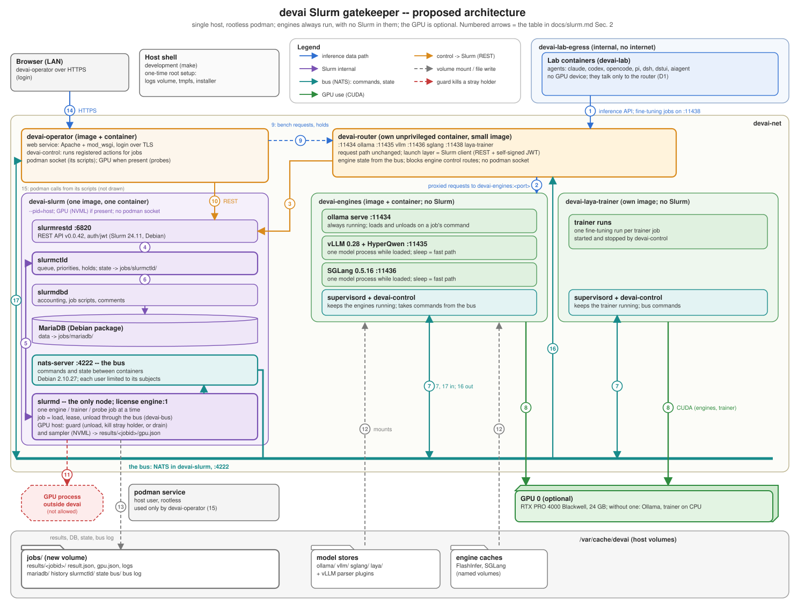

# Slurm gatekeeper -- architecture

**Status: proposed (2026-09-30), not built.** This is the design the phases of
[the plan](plans/slurm-gatekeeper.md) implement; the plan holds the operator's
decisions (D1-D14). **(measured)** marks a fact measured on this host in an
earlier spike (2026-09-29); that spike tested two layouts since discarded and is
obsolete, so only facts that do not depend on the layout are marked this way.
The spike ran Slurm 26.05.4; the design now uses Debian's 24.11.5 (D12), which
ships the same plugins (checked 2026-09-30) but has not been run yet.
**(untested)** marks what nothing has run yet; everything else is proposal. Once built, this document is
the source of truth for Slurm in devai, as [router.md](router.md) is for the
router.

This is the third layout. The first (one Slurm node per backend image) had far
too many moving parts; the second put Slurm and every backend into one image.
The operator then decided (D9-D10): the backends image carries **no Slurm at
all**, and Slurm runs in its **own image and container**. A job therefore
starts its process inside the backend's container with `podman exec`.

## 1. What changes

Today the router starts engines itself: for every model switch it recreates a
podman container, and it decides what holds the GPU from its own flags. It
never looks at the card, so an engine can start on a GPU another process still
holds -- the failure that cost the re-bench of 2026-09-28 a day.

Proposed:

- **Slurm is the only thing that starts GPU work.** It runs in one container,
  `devai-slurm`: controller, accounting with MariaDB, REST API and the node
  daemon, a single-node cluster. One cluster license lets one engine, trainer
  or probe job run at a time, with or without a GPU; Slurm also queues and
  suspends work and records every job.
- **Backends carry no Slurm.** `devai-engines` (Ollama, vLLM, SGLang; built by
  the [image-reduction plan](plans/minimal-external-images.md)) and
  `devai-laya-trainer` are permanent, idle containers. A Slurm job starts its
  engine or training run inside them with `podman exec` and stops it the same
  way.
- **The router** stays a separate, unprivileged container and the only entry
  point for inference; its launch layer becomes a Slurm client.
- **The operator's interface is `devai-operator`,** a web service in its own
  image and container ([its plan](plans/devai-operator.md)). Its actions --
  builds, pulls, probes, benches, backups -- are devai's scripts, run as Slurm
  jobs inside `devai-operator`. The host shell stays for development and the
  one-time root setup.
- **The GPU guard** in `devai-slurm` checks the card before every GPU job and
  kills or refuses anything that holds it.
- **One version per backend, CUDA 13.1, everything compiled here** (D8, D11).
- **The GPU is optional** (image-reduction plan, M15): one host check decides
  at launch; a host without an NVIDIA GPU runs only Ollama (CPU) and the laya
  trainer, and `devai-slurm` skips the guard and the sampler.

## 2. Architecture at a glance



Source: [`scripts/diagrams/slurm_architecture.py`](../scripts/diagrams/slurm_architecture.py)
(explicit coordinates; stdlib only). Re-render with
`python3 scripts/diagrams/slurm_architecture.py`.

| # | From -> to | What | How | Status |
|---|---|---|---|---|
| 1 | lab agents -> router | inference (OpenAI, Anthropic, Ollama APIs); fine-tuning jobs on :11438 | HTTP, `devai-lab-egress` | unchanged |
| 2 | router -> engine | proxied requests to `devai-engines:<port>` | HTTP, `devai-net` | today's path, new host name |
| 3 | router -> slurmrestd | submit, cancel, job and node state | REST v0.0.42, JWT the router signs itself | measured on 26.05 (v0.0.44) |
| 4 | slurmrestd -> slurmctld | the same, as Slurm RPC | inside `devai-slurm` | measured |
| 5 | slurmctld <-> slurmd | launch, signal, kill the job script; node health | inside `devai-slurm` | measured |
| 6 | slurmctld -> slurmdbd -> MariaDB | accounting records | inside `devai-slurm` | measured |
| 7 | job script -> podman -> target container | `podman exec <container> devai-run <jobid> ...`; `devai-kill <jobid> <signal>` | the host's podman socket | untested |
| 8 | engine, trainer -> GPU | CUDA (on a host with a GPU) | device via CDI | measured (engines on this card today) |
| 9 | operator jobs -> router | a bench's inference requests; hold / release | HTTP | requests measured; holds proposed |
| 10 | `devai-operator` -> slurmrestd | actions submitted as jobs; queue, history; `scontrol suspend` / `resume` | REST + JWT; `podman exec devai-slurm` | proposed |
| 11 | GPU guard -> stray process | SIGTERM, then SIGKILL; if still busy, drain (on a host with a GPU) | signals (`--pid=host`) | measured |
| 12 | host volumes -> containers | model stores, engine caches, the laya store | mounts | measured (model store, FlashInfer cache) |
| 13 | `devai-slurm` -> `jobs/` | results, GPU samples, MariaDB files, controller state | files | proposed |
| 14 | browser -> `devai-operator` | the web service: actions, jobs and logs, lab links, host setup | HTTPS, login | proposed |
| 15 | `devai-operator` -> podman | its scripts' podman calls: builds, compose, bench and lab containers | the host's podman socket | proposed |

## 3. Containers and images

| Container | Image | Holds | Privileges |
|---|---|---|---|
| `devai-slurm` | `devai-slurm` (new, built here on the pinned `debian:trixie-slim`) | slurmctld, slurmdbd, slurmrestd, MariaDB, slurmd, the GPU guard, the GPU sampler, a podman client | `--privileged --cgroupns=private --pid=host`; the host's podman socket read-write; the GPU via CDI, for NVML only, when the host has one |
| `devai-engines` | `devai-engines` (image-reduction plan) | Ollama, vLLM 0.28 + HyperQwen, SGLang 0.5.16, each in its own env; `devai-run`, `devai-kill` | GPU via CDI when present |
| `devai-laya-trainer` | `devai-laya-trainer` (its own image, as today; its base is the image-reduction plan's call) | the laya trainer; `devai-run`, `devai-kill` | GPU via CDI when present |
| `devai-operator` | `devai-operator` ([its plan](plans/devai-operator.md)) | the web service (Apache + mod_wsgi), devai's scripts and the tools they call; the target of operator jobs | the host's podman socket read-write; the GPU when present (probes) |
| `devai-router` | its own small image | the router | none |

No Slurm package is installed in `devai-engines`, `devai-laya-trainer`,
`devai-operator` or the lab image; `devai-run` and `devai-kill` are two short devai shell scripts.
`devai-engines` and `devai-laya-trainer` run `tini` and an idle loop as PID 1
and do nothing until a job execs into them.

### 3.1 `devai-slurm`

- **Image:** Debian trixie packages only -- Slurm 24.11.5 (`slurmctld`,
  `slurmd`, `slurmdbd`, `slurmrestd`, `slurm-wlm-jwt-plugin`,
  `slurm-wlm-mysql-plugin`; D12), MariaDB 11.8, supervisor, tini and podman --
  plus devai's scripts in `/usr/local/lib/devai/`. No source build: Slurm needs
  no NVML support, because in this layout it does not account GPUs itself.
  Checked in the packages (2026-09-30): REST data parsers v0.0.40 to v0.0.42,
  `auth_slurm` (which also serves `cred/slurm`; SchedMD's 26.05 build had no
  separate `cred_slurm` plugin either, and `CredType=cred/slurm` worked there),
  `auth_jwt`, `accounting_storage_mysql`, `cgroup_v2`, `proctrack_cgroup`,
  `jobacct_gather_cgroup`. Build stage and final image both
  use the one digest-pinned `debian:trixie-slim` Makefile variable every devai
  image shares (image-reduction plan, M13).
- **Why each privilege:** `--privileged --cgroupns=private` gives slurmd the
  cgroup control it needs (measured, rootless); `--pid=host` lets the guard and
  the sampler see and signal GPU processes, whose PIDs NVML reports in the host
  namespace (measured); the GPU device, on a host that has one, is there only
  for NVML (the guard, the sampler) -- no CUDA work runs here; the podman socket
  is how jobs reach the backend containers.
- **Entrypoint:** move the container's processes out of its cgroup root so
  controllers can be delegated (without it slurmd stops with "Controller memory
  is not enabled"; measured), then start supervisord, which runs MariaDB,
  slurmdbd, slurmctld, slurmrestd and slurmd.
- **Slurm configuration:** one node, with no GPU resource declared and explicit
  `CPUs=` / `RealMemory=` (`slurmd -C` counts 8 of 24 CPUs; measured); one
  cluster license `Licenses=engine:1`; `CompleteWait=30`;
  one partition; `auth/slurm` plus `auth/jwt`; `proctrack/cgroup`,
  `task/cgroup` with `IgnoreSystemd=yes` and no `Constrain*` (`cpuset` is not
  delegated here); `AccountingStoreFlags=job_comment,job_script`;
  `KillWait=30`; `Prolog` / `Epilog` = the guard. MariaDB runs with
  `--innodb-snapshot-isolation=OFF` (measured: 11.8's default makes slurmdbd
  warn it will die on a write conflict).
- **Ports on `devai-net`:** 6820 (slurmrestd). Nothing else is exposed.

## 4. How a job runs a process in another container (untested)

Every job script is a thin wrapper around two helpers that live in each target
image:

- `devai-run <jobid> <command...>` starts `command` in a new process group,
  records the group under `/run/devai/jobs/<jobid>` inside the container, and
  waits for it; its exit status is the command's.
- `devai-kill <jobid> <signal>` sends `signal` to that process group.

An engine job script, as the router would submit it (the arguments are the
router's launch configuration, as today):

```bash
#!/bin/bash
C=devai-engines
stop() { podman --remote exec "$C" devai-kill "$SLURM_JOB_ID" TERM
         sleep 10; podman --remote exec "$C" devai-kill "$SLURM_JOB_ID" KILL; }
trap stop TERM INT
podman --remote exec "$C" devai-run "$SLURM_JOB_ID" \
  /opt/vllm/bin/python3 -m vllm.entrypoints.openai.api_server \
  --model /models/Qwen3.8-27B-W4A16-devai-AutoRound --port 11435 ... &
wait $!
```

What follows from this, because Slurm now owns only the local `podman exec`
client and not the engine:

| Concern | Who does it |
|---|---|
| start | the job script, through `podman exec` |
| cancel (`scancel`, time limit) | Slurm signals the job script; its trap runs `devai-kill ... TERM`, then `KILL`. `KillWait` (30 s) must exceed the trap's 10 s. The epilog repeats `devai-kill ... KILL` as a backstop |
| engine exits by itself | `devai-run` returns its status; `podman exec` returns it; the job ends with it |
| suspend / resume | `devai-jobs`: `scontrol suspend` (Slurm's state and clock) **and** `devai-kill ... STOP`; resume is `CONT` then `scontrol resume`. Slurm's own suspend freezes only the local client |
| GPU memory and utilisation (a host with a GPU) | a sampler started by the prolog polls NVML every 5 s and writes `results/<jobid>/gpu.json`; the epilog stores its peak and mean in the job's `AdminComment`. There is one GPU job at a time, so the whole card is the job's |
| GPU energy | NVML's energy counter at prolog and epilog (Slurm reads none on NVIDIA; measured) |

The obsolete spike measured the other model -- the engine as the job's own
process on a Slurm node, where `scancel` freed the GPU in 0.23-0.30 s and Slurm
accounted its GPU memory. None of that carries over, and none of the exec path
has been run: whether
`podman exec` passes the exit status and survives a long run, what it adds to
start-up, and whether the trap, the kill helpers and the sampler behave as
described.

## 5. Jobs

| Kind | License | Target container | Runs | Time limit | Submitted by |
|---|---|---|---|---|---|
| engine | `-L engine` | `devai-engines` | the backend's server on its port (11434 Ollama, 11435 vLLM, 11436 SGLang) | none (keep-warm) | router only |
| trainer | `-L engine` | `devai-laya-trainer` | one fine-tuning job | `LAYA_MAX_HOLD_S` (900 s) | router (:11438 API) |
| probe | `-L engine` | `devai-engines` | the engine plus the prober client | 60 min | `make probe-*` |
| operator action | the license for GPU actions (bench), else none | `devai-operator` | one of devai's scripts: bench, pull, build, backup, ... | per action; bench: `--time=32 --signal=B:INT@120` | `devai-operator` |

The license, not the GPU, is what lets one engine run at a time, so the rule is
the same on a host without a GPU: a second job asking for it waits as
`PENDING (Licenses)` (measured). `CompleteWait=30` makes Slurm start nothing
while a job is still completing, so the next job's prolog always follows the
previous job's epilog (Slurm's documented behaviour; not measured). On a host
without a GPU the router submits only Ollama and trainer jobs; vLLM and SGLang
requests are refused before anything is submitted.
Every job carries a JSON comment (kind, backend, model, context, MTP, hold,
requester, git commit); submitted through REST it arrives intact (measured).

## 6. GPU guard

On a host with a GPU, the prolog of every engine, trainer and probe job, in
`devai-slurm`:

1. waits up to 10 s for an idle card (no compute process, at most 512 MiB
   used);
2. otherwise sends each holder SIGTERM, then SIGKILL after 5 s (measured from a
   privileged container with `--pid=host`: a PyTorch process in another
   container died and the card went back to 2 MiB);
3. if the card is still busy, or a holder belongs to another user, exits 1:
   Slurm drains the node and holds the job, so nothing starts on a busy card
   (measured);
4. for vLLM jobs, deletes vLLM's compile cache inside `devai-engines`
   (`/root/.cache/vllm`, `/tmp/torchinductor_*`): the container outlives its
   jobs, a restart with that cache reached `/health` in 27-29 s instead of 95 s
   (measured), and docs/router.md explains why it must not persist -- it
   under-measures activation memory and OOM-killed engines on 2026-09-23;
5. starts the GPU sampler and reads the energy counter.

The epilog stops the sampler, writes `gpu.json`, kills any leftover of the job
(`devai-kill ... KILL`) and checks the card is idle again; if not, it exits 1
and the node drains. With one node and `CompleteWait`, this check cannot race
the next job. On a host without a GPU, prolog and epilog only kill the job's
leftovers.

## 7. Router

The request path stays: listeners, override parsing, API normalisation,
reasoning policy, tool stripping, admission, SSE keepalive, drain, the mutation
guard, and the launch configuration it computes from the probe caches. The
podman launch layer goes (`containerRecreate`, `stopOtherBackends`,
`unloadOllama`, `backendVanished`, the job-runner hold), and with it the
router's podman socket, which moves to `devai-slurm`. Instead: a Slurm client
and one GPU record, rebuilt from Slurm on boot and refreshed on every decision.
The router signs its own HS256 JWT with the shared key (measured: slurmrestd
accepts it).

A request that needs an engine:

1. the right engine job is running and healthy: proxy;
2. it is pending or starting: wait, with SSE keepalive;
3. the GPU holds something else: a trainer job, or an engine bound to an active
   hold, gets the client a 503 with `Retry-After`; an ordinary engine is
   drained, cancelled and replaced;
4. the new job is refused by the guard: cancel it and return 503 naming the
   holder, without charging the launch breaker, and resubmit rather than
   release (Slurm delays a released job by about 2 minutes; measured); it dies
   before it is healthy: 502 with the tail of its log, breaker charged.

**Holds.** A bench keeps its engine for its whole run:
`POST /devai/v1/holds {job_id, model}` starts or keeps the engine and answers
when it is healthy; `DELETE /devai/v1/holds/{job_id}` releases it. A hold is
active while its job runs, paused while it is suspended, and dropped when the
job ends.

Measured timings that carry over: REST submit to running 1.0-1.3 s; the 27B
engine healthy about 95 s after a cold start.

## 8. Flows

- **Switch:** drain the current engine, cancel its job (the trap kills the
  engine), submit the new one; the guard checks the card; the engine starts.
- **Bench:** one operator job per (model, task) runs the bench script in
  `devai-operator`: take a hold, run the task,
  write `result.json`, release. At 30 minutes Slurm sends SIGINT and the job
  scores the unbroken prefix, as `harvest_truncated.py` does today.
- **Interrupt, same engine** (D1): suspend the bench job, run the quick job,
  resume.
- **Interrupt, another engine:** suspend the bench job, run the quick job on its
  engine, re-take the bench's hold (the engine switches back), resume.
- **Suspending a bench job** (D13) does not freeze it, because inspect's
  per-sample clock would keep running: the running task is cancelled and the
  same task is submitted again, held; resume releases it and the task starts
  again from its first sample. The cancelled attempt keeps its log and is not
  scored. Whether a released job starts without delay is untested (a requeued
  job waited about 130 s in the spike, which is why this resubmits instead).
- **Restarts:** the router rebuilds its record from Slurm, and engines keep
  serving meanwhile; if `devai-slurm` restarts, running jobs lose their script
  and the epilog never runs, so the entrypoint kills every process group under
  `/run/devai/jobs` in the target containers before slurmd starts; if a target
  container restarts, its engine dies and its job fails.

## 9. History

slurmdbd keeps every job: times, state, exit code, suspended time, the comment,
the job script, and the GPU summary the epilog puts in `AdminComment`. Each
job's `/var/cache/devai/jobs/results/<jobid>/` holds its log, `result.json`
(written by the job), `gpu.json` (samples, peak, mean, energy) and artifacts.
`devai-jobs` (devai-tools) joins the two: `devai-jobs list --since yesterday`,
`show <id>`, `queue`, `cancel`, `hold` / `release`, `suspend` / `resume`,
`interrupt`. The bench leaderboard stays and records each task's job id.

## 10. Configuration

In the repository, `deploy/slurm/`: the Dockerfile, `slurm.conf`,
`cgroup.conf`, `slurmdbd.conf.in`, `supervisord.conf`, the entrypoint, the
guard and the sampler. `devai-run` and `devai-kill` live in `deploy/slurm/` too;
this plan adds their COPY lines to `deploy/Dockerfile.engines` and
`deploy/Dockerfile.laya-trainer`. Generated once by `make slurm-init`, never committed:
`~/.config/devai/slurm/slurm.key`, `jwt_hs256.key` and the MariaDB password
(mode 0600; backed up by `devai-backup`). Plain files, not sops: the sops/age
scaffold goes to the attic with MCP (image-reduction plan, M12).

## 11. Failure modes

| Failure | Effect | Handling |
|---|---|---|
| a Slurm daemon exits | supervisord restarts it; warm engines keep serving | the router answers 503 while it cannot launch |
| MariaDB or slurmdbd down | jobs run; history is delayed | slurmctld spools the records |
| GPU held outside Slurm | killed by the guard, or node drained | 503 naming the holder |
| engine crashes | `devai-run` returns non-zero; the job fails | next request relaunches (breaker) |
| job script killed before its trap ran | the engine keeps running | the epilog's `devai-kill ... KILL`, then the idle check |
| `devai-slurm` restarts | job scripts gone, engines orphaned | the entrypoint kills recorded process groups first |
| a target container restarts | its engine dies; the job fails | router resubmits on demand |

## 12. Security

- `devai-slurm` and `devai-operator` hold the host's podman socket read-write,
  which is equivalent to the devai user on the host, and `devai-slurm` runs
  whatever job scripts it is given. So **anyone who can submit a job, or log in
  to `devai-operator`, controls the host user**: the JWT key and
  `slurm.key` are as sensitive as that user's login. Only the router (read-only
  mount) and `devai-jobs` (0600 host file) get the JWT key. The router no
  longer holds the socket.
- `devai-slurm` is on `devai-net` only; the lab cannot reach slurmrestd.
- The backend containers are unprivileged apart from the GPU; nothing new is
  published to the LAN.

## 13. From today to this, and who does what

| Today | Proposed | Done by |
|---|---|---|
| 5 engine containers recreated per model by the router | `devai-engines` (permanent) + `devai-laya-trainer` | image-reduction plan (image); this plan (permanent run, helpers) |
| 8 engine images, 3 distributions, stock builds | one engines image, trixie, CUDA 13.1, compiled here | image-reduction plan |
| vllm and vllm-devai on 11435 / 11437 | one `vllm` backend on 11435 | image-reduction plan |
| the router holds the podman socket and recreates containers | `devai-slurm` holds the socket; the router is a Slurm client | this plan |
| no check that the card is free | the prolog guard | this plan |
| laya busy hold in the router | trainer jobs | this plan |
| bench clean slate and deadline in `bench-sync.py` | bench runs as operator jobs, with a time limit and a hold | this plan |
| probers start engine containers | probe jobs | this plan |
| results scattered | slurmdbd + `jobs/results/` + `devai-jobs` | this plan |
| operations are Makefile targets in a host shell | `devai-operator`, a web service running devai's scripts as jobs; the Makefile stays for development | devai-operator plan |
| lab containers have the GPU | no GPU device in the lab | this plan |

The re-probe on the single backend versions, and dropping what fails, belong to
the image-reduction plan.

## 14. Open points

1. **The exec path** (Sec. 4) is untested end to end: exit status, long runs,
   start-up overhead, the trap and kill helpers, suspend through `STOP` /
   `CONT`, the sampler. It is the first thing Phase 1 tests.
2. ~~inspect's clock during a suspend~~ -- a suspended bench task is re-run
   from its first sample (D13).
3. ~~A `devai-workload` container for bench and test clients~~ -- not needed:
   they are operator actions, run as jobs in `devai-operator`.
4. ~~The laya trainer's internals~~ -- they move from its HTTP controller to
   trainer jobs; its API toward aiagent does not change. Agreed by the owner
   (D14).
5. **Debian's Slurm 24.11.5 has not been run** here (D12); the spike ran
   26.05.4. Only its packages' contents were read (`apt-get download`,
   `dpkg -c`). Phase 1 starts it before anything else.
